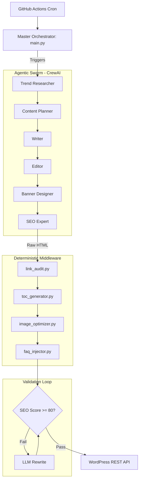

# AutoSEO Publisher

[](https://www.python.org/downloads/)
[](https://github.com/Baskar-forever/AutoSEO_Publisher/actions)
[](https://opensource.org/licenses/MIT)

AutoSEO Publisher is an autonomous, agentic content pipeline that orchestrates LLM swarms to research, draft, optimize, and deploy production-ready SEO articles.

Built with CrewAI, the system features a deterministic validation middleware and an agentic self-healing loop that guarantees a minimum SEO threshold before pushing content to a live WordPress site through automated workflows.

---

## System Architecture




## Core Design Principles

### Agentic Orchestration

Specialized agents handle distinct phases of the editorial lifecycle, minimizing hallucination through focused, low-temperature (0.1) prompts.

### Self-Healing Output

If generated HTML fails deterministic SEO validation (for example, keyword density mismatches or missing image alt tags), the content is routed back to the LLM with validation feedback for automatic correction.

### Stateless CI/CD

Designed to run ephemerally on GitHub Actions Ubuntu runners with no persistent runtime dependencies.

---

# Quick Start

## Prerequisites

- Python 3.10+
- WordPress instance with Application Passwords enabled
- API keys for your preferred LLM provider
- Serper.dev API key

## Local Development Setup

### Clone the Repository

```bash
git clone https://github.com/yourusername/AutoSEO_Publisher.git
cd AutoSEO_Publisher
```

### Create a Virtual Environment

```bash
python -m venv venv
```

Linux / macOS:

```bash
source venv/bin/activate
```

Windows:

```bash
venv\Scripts\activate
```

### Install Dependencies

```bash
pip install -r requirements.txt
```

### Configure Environment Variables

```bash
cp .env.example .env
```

Populate the `.env` file with your credentials.

---

# Configuration Schema

| Variable | Description | Required |
|-----------|-------------|-----------|
| OPENAI_API_KEY | LLM Provider API Key | Yes |
| MODEL | Target Model (e.g. gemini/gemini-2.5-flash) | Yes |
| SERPER_API_KEY | Search and Trend Discovery API Key | Yes |
| WP_URL | WordPress Website URL | Yes |
| WP_USER | WordPress Username | Yes |
| WP_APP_PASSWORD | WordPress Application Password | Yes |

---

# Deployment Lifecycle

## Manual Execution

Run pipeline in safe mode (draft publish):

```bash
python main.py
```

Run pipeline and publish live:

```bash
python main.py --index
```

Bypass validation and force publish:

```bash
python main.py --force
```

---

## Automated CI/CD Execution

The repository includes a GitHub Actions workflow:

```text
.github/workflows/auto_publish.yml
```

The workflow can be configured to execute automatically on a recurring schedule.

### Setup

1. Navigate to:
   Settings → Secrets and Variables → Actions

2. Add all environment variables listed in the Configuration Schema as Repository Secrets.

3. Enable GitHub Actions for the repository.

4. Trigger manually or allow scheduled execution.

---

# 🤝 Contributing

Contributions, issues, and feature requests are welcome.

1. Fork the repository
2. Create a feature branch

```bash
git checkout -b feature/AmazingFeature
```

3. Commit your changes

```bash
git commit -m "feat: Add AmazingFeature"
```

4. Push to GitHub

```bash
git push origin feature/AmazingFeature
```

5. Open a Pull Request

---

# License

Distributed under the MIT License.

See the LICENSE file for more information.
